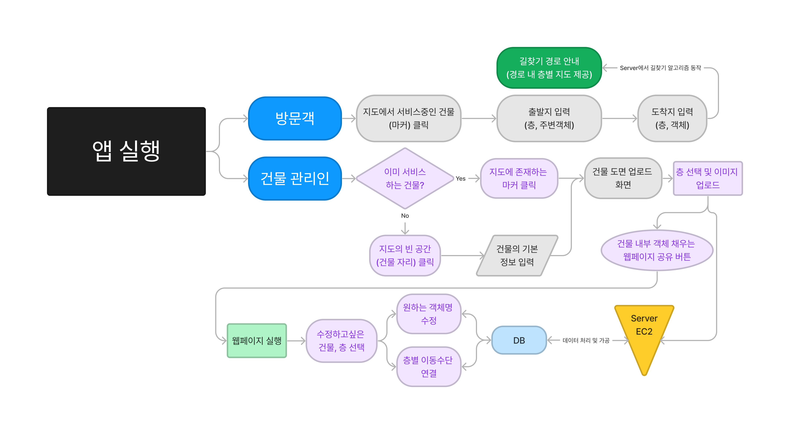

# Indoor_Map

## 2023 2학기 중앙대학교 소프트웨어학부 캡스톤 디자인 3분반 7팀

### PART. Frontend (APP)

[Backend : Algoritm + Server Part](https://github.com/PROMLEE/Indoor_map_algorithm)  

[부가기능: React Part](https://github.com/PROMLEE/Indoor_map_react)  
<!-- [Frontend : ](https://github.com/PROMLEE/Indoor_map_flutter)   -->

  
주제: 도면(안내도) 기반 image segmentation 기술을 이용한 실내 길찾기 지원 플랫폼 제작

